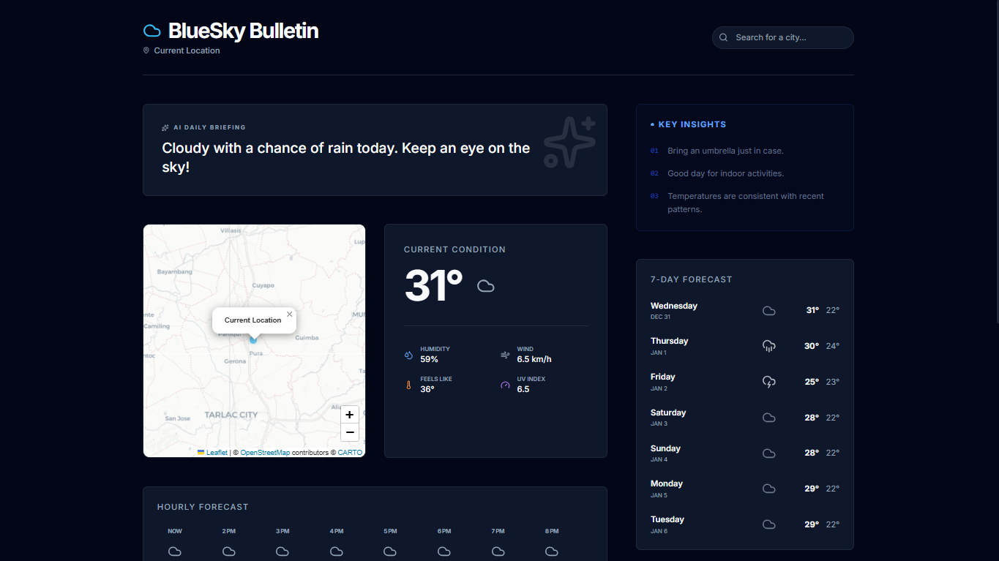
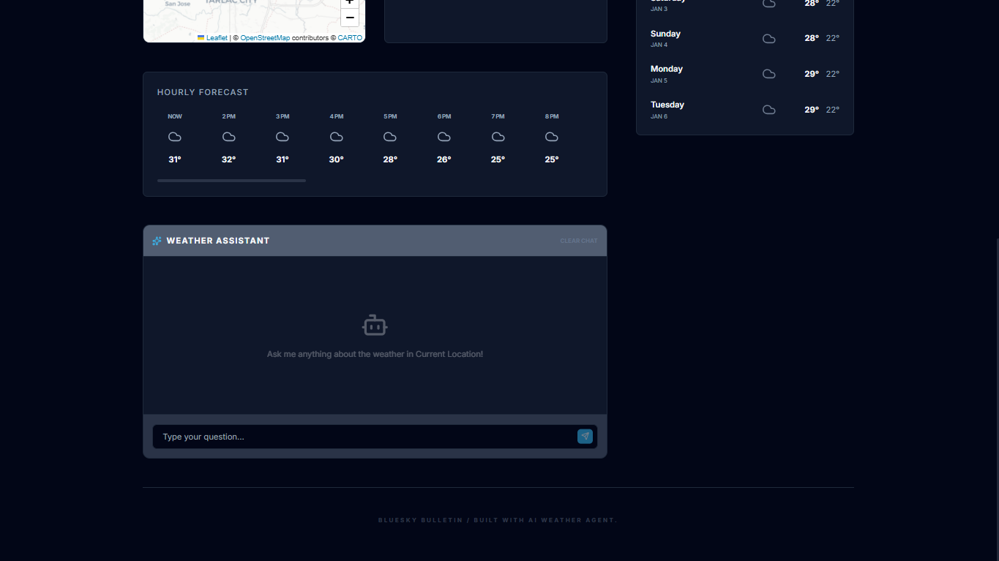
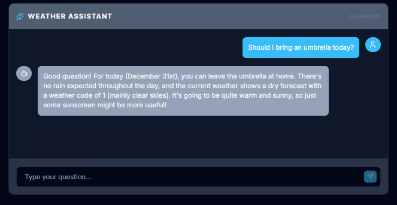

# BlueSky Bulletin | AI Weather Insights

BlueSky Bulletin is a modern, AI-powered weather forecast platform that transforms raw meteorological data into actionable, human-readable insights. Leveraging the performance of Next.js 14 and the intelligence of Large Language Models via OpenRouter, it provides users with personalized weather narratives and recommendations.

## ✦ Key Features

- **AI Weather Insights:**
  - **Daily Briefing:** Concise, 2-3 sentence summaries of the day's weather.
  - **Personalized Recommendations:** Activity suggestions based on current and forecast conditions.
  - **Proactive Alerts:** AI-generated notifications for significant weather changes.
- **Interactive Weather Map:** Real-time data visualization using Leaflet.js.
- **Dynamic Search & Geolocation:** Automatic location detection and global search capabilities.
- **Premium UI/UX:** A sophisticated, responsive design built with Vanilla CSS and Tailwind CSS, following a "human-crafted" aesthetic.
- **Stateless & Secure:** Privacy-first design with no persistent user storage for the MVP.

## ✦ Screenshots

Here are some screenshots of the BlueSky Bulletin application:

 


## ✦ Tech Stack

- **Framework:** [Next.js 14 (App Router)](https://nextjs.org/)
- **UI Library:** [React 18](https://reactjs.org/)
- **Styling:** [Tailwind CSS](https://tailwindcss.com/)
- **Mapping:** [Leaflet.js](https://leafletjs.com/) & [React-Leaflet](https://react-leaflet.js.org/)
- **Weather Data:** [Open-Meteo API](https://open-meteo.com/)
- **AI Intelligence:** [OpenRouter SDK](https://openrouter.ai/)
- **Data Validation:** [Zod](https://zod.dev/) & [Validator.js](https://github.com/validatorjs/validator.js)
- **Deployment:** [Vercel](https://vercel.com/)

## ✦ Getting Started

### Prerequisites

- Node.js 18.17 or later
- An OpenRouter API Key

### Installation

1. **Clone the repository:**
   ```bash
   git clone https://github.com/your-username/bluesky-bulletin.git
   cd bluesky-bulletin
   ```

2. **Install dependencies:**
   ```bash
   npm install
   ```

3. **Configure Environment Variables:**
   Create a `.env.local` file in the root directory and add your keys:
   ```env
   OPENROUTER_API_KEY=your_api_key_here
   ```

4. **Run the development server:**
   ```bash
   npm run dev
   ```

Open [http://localhost:3000](http://localhost:3000) with your browser to see the result.


## ✦📂 Project Structure

- `/app`: Next.js App Router pages and API routes.
- `/components`: Reusable UI components (AI panels, maps, search).
- `/lib`: Core logic including AI orchestration, weather fetching, and utilities.
- `/hooks`: Custom React hooks for data fetching and state management.
- `/public`: Static assets (images, fonts).

## ✦📄 License

This project is private and intended for demonstration purposes.
